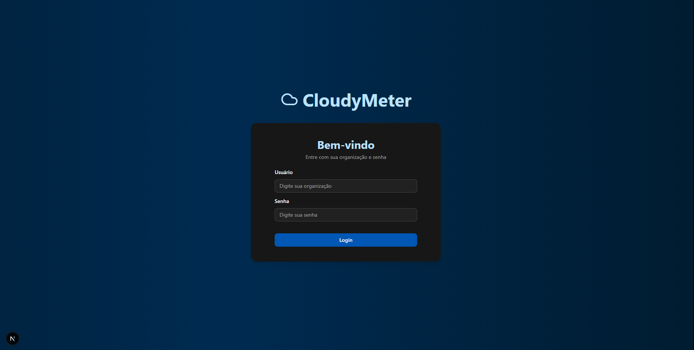
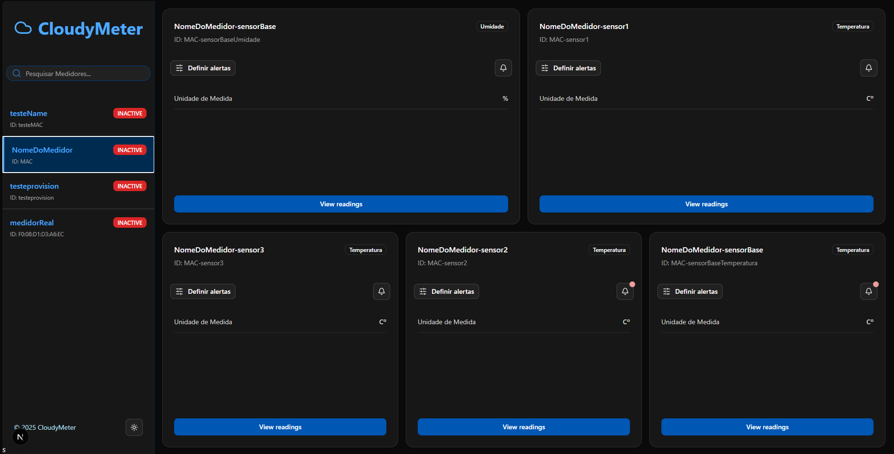
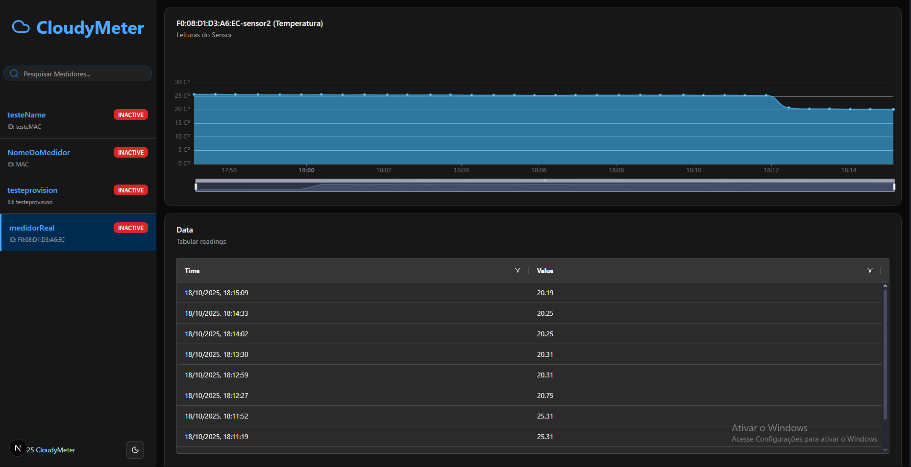
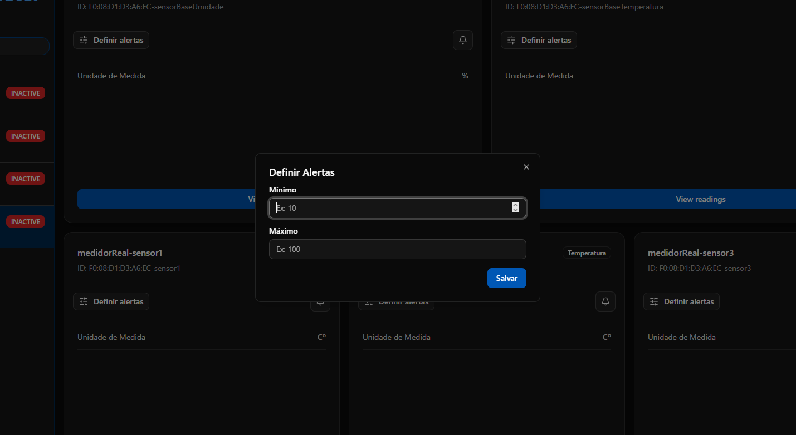
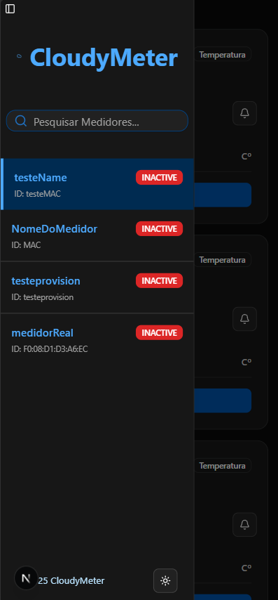
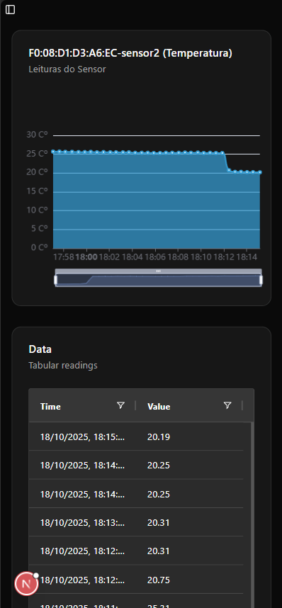
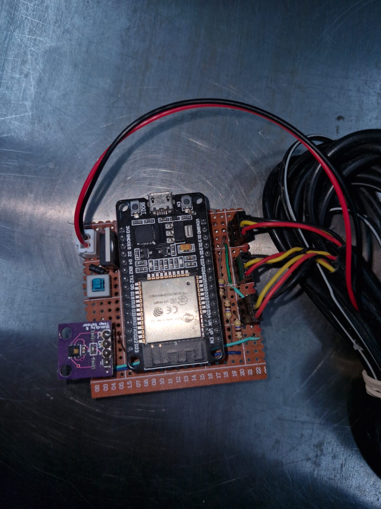

# 🌧️ CloudyMeter

**CloudyMeter** is a complete IoT-based monitoring system developed as a software engineering project (TCC).  
It integrates physical sensors connected to an Arduino board (or simulated in Python), real-time data transmission using **MQTT**, backend processing with **Java Spring Boot**, persistence in **PostgreSQL**, dashboards in **React/Next.js**, and **Telegram Bot** integration for notifications and device registration.

---

## 🚪Application Access

Access CloudyMeter Website:
🌐 https://cloudy-meter-r4n8-22s4t1pys-carlos-manoel-wendorffs-projects.vercel.app/

Access CloudyMeter API documentation:
🗃️ https://cloudymeterapi-d8erd7cnata4b6dn.brazilsouth-01.azurewebsites.net/swagger-ui/index.html#

Talk with CloudyMeter Bot to start testing the application:  
🤖 https://web.telegram.org/k/#@CWCloudyBot

---

## 📁 Project Structure

```
.
├── arduino/          # Arduino code to read sensor data and publish via MQTT
├── backend/          # Java Spring Boot application to process and store data, handle authentication and sessions
├── database/         # Docker Compose for creating and configuring the PostgreSQL database
├── simulator/        # Python simulator for testing without physical hardware
├── frontend/         # Web application built with React + Next.js
├── diagrams/         # Diagrams describing the project
└── README.md
```

---

# 🖥️ System Screenshots

Below are key screens of **CloudyMeter**, showing the full experience from login to detailed meter readings.

---

## 🔐 **1. Login Screen**

> Organization-based authentication to access the CloudyMeter dashboards.

<p align="center">
  
</p>

---

## 📊 **2. Dashboard – Overview**

> Shows meter sensors, alerts and options for threshold configuration.

<p align="center">
  
</p>

---

## 🌡️ **3. Meter Details & Readings**

> Displays charts and the current state of a specific meter.

<p align="center">
  
</p>

---

## ⚙️ **4. Threshold Configuration**

> Allows adjusting temperature/humidity limits and enabling automated alerts.

<p align="center">
  
</p>

---

## 🧩 System Screenshots Grid

<p align="center">
  <table>
    <tr>
      <td align="center">
        <br/>
        <b>Login</b>
      </td>
      <td align="center">
        <br/>
        <b>Dashboard</b>
      </td>
    </tr>
    <tr>
      <td align="center">
        <br/>
        <b>Meter Details & Readings</b>
      </td>
      <td align="center">
        <br/>
        <b>Threshold Configuration</b>
      </td>
    </tr>
  </table>
</p>

## 📱 Mobile Screenshots

### Mobile View – Dashboard, Meter Details & Readings

<p align="center">
  <table>
    <tr>
      <td align="center">
        
        <br/><b>Dashboard (Mobile)</b>
      </td>
      <td align="center">
        
        <br/><b>Meter Details (Mobile)</b>
      </td>
    </tr>
  </table>
</p>

## 📱 Physical Meter

### Physical Meter - Sensors and Board

<p align="center">
  <table>
    <tr>
      <td align="center">
        
        <br/><b>Board and Sensors</b>
      </td>
    </tr>
  </table>
</p>

## 📷 Diagrams

### System Architecture


### Entity-Relationship Diagram


### Sequence

#### Auth Flow


#### MQTT Flow


### Meter

## 

## 🛠️ Technologies Used

- **Arduino + sensors** → physical data collection
- **Python simulator** → simulate meters and sensors without hardware
- **MQTT** → lightweight IoT communication protocol
- **Java + Spring Boot** → backend with REST API, processing, alerts, Telegram bot
- **PostgreSQL** → relational database
- **React + Next.js** → dashboard UI
- **Telegram Bot** → real-time notifications and device/organization registration
- **Swagger UI** → API documentation

---

## 🚀 How to Run

### 1. Arduino

- Upload the code from `arduino/`
- Configure Wi-Fi and MQTT broker credentials

### 2. Backend (Java)

```bash
cd backend/
./mvnw spring-boot:run
```

- Ensure PostgreSQL is running
- Create organizations manually or via Telegram bot
- Swagger UI available for testing

### 3. Database

- Run the SQL scripts located in `database/`

### 4. Frontend

```bash
cd frontend/
npm install
npm run dev
```

---

## 📌 Features

- Real-time temperature & humidity monitoring
- Historical data persistence
- Interactive charts and alerts
- Multi-sensor per device
- Multi-organization isolation
- Automatic sensor creation (1 humidity, 1 base temp, +3 temp sensors)
- Thresholds editable via dashboard
- Alerts generated when limits are exceeded
- Telegram notifications
- Device/organization registration via Telegram
- JWT authentication

---

## 🔐 Authentication & Authorization

- Organizations authenticate with _name + password_
- Backend issues a JWT token
- Frontend stores the token and includes it in API requests
- Each organization can only access its own meters
- Tokens expire and are fully managed by the backend

---

## 📄 Full Documentation

Full TCC paper (Google Docs):  
📎 https://docs.google.com/document/d/1JZ3B5b4yDFAEL1ascxJWgDR6ur6_lXzRr40IBrODyE4/edit?usp=sharing

Project video on YouTube - Benchmark with simulated device:  
🎥 https://youtu.be/Ac6TsLdMpkM?si=MwarlN-7i_JpWxqE

Project video on YouTube - Benchmark with physical device:  
🎥 https://youtu.be/jt2o1N0cPOM?si=JAziVFmNov37Gc99

---

## 🪧 Presentation Banner

<p align="center">
  
</p>

---

## ✍️ Author

Carlos Manoel Wendorff  
Software Engineering – Católica de Santa Catarina

---
